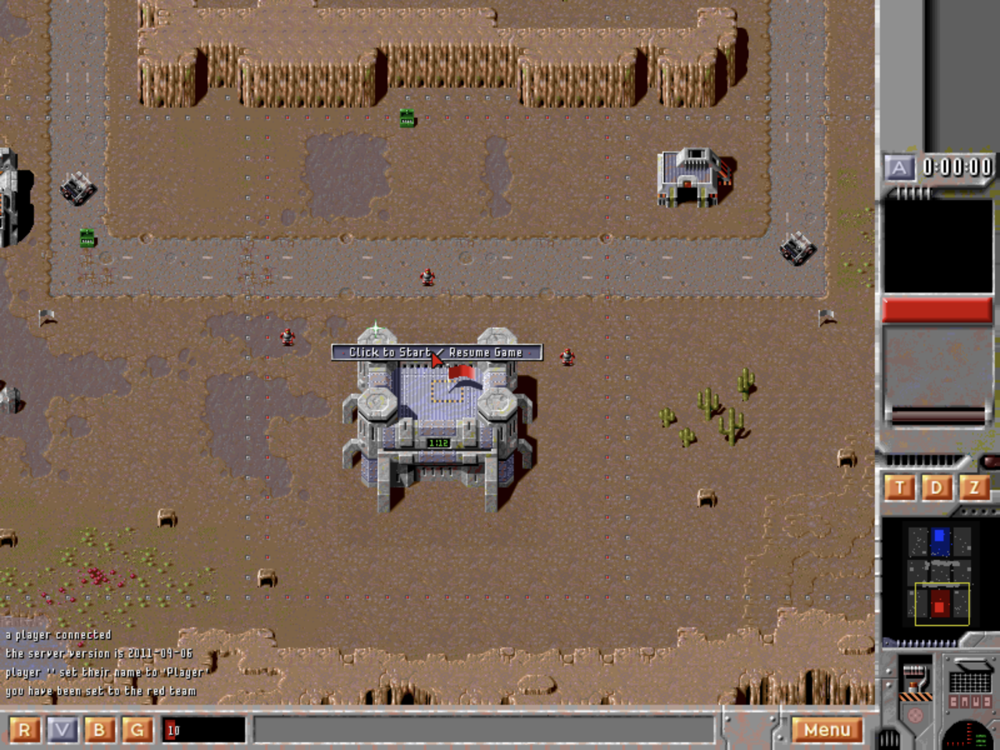

# Zod

A modernized build of the **Zod Engine** — the open-source remake of the 1996
Bitmap Brothers real-time strategy game *Z* — brought up to date to build and
play cleanly on current macOS (Apple Silicon), Linux, and Windows, on **native
SDL3**.

This is a fork of the Zod Engine by Michael Bok / Nighsoft
(<http://zod.sourceforge.net/>), originally released under the GPLv3. All the
original gameplay is intact; this fork focuses on getting it building and
running well on modern systems.



## What's new in this fork

- **Ported from SDL 1.2 all the way to native SDL3** — no compatibility shims.
  Modern SDL3 rendering, input, threads, and SDL3_mixer (`MIX_` API) audio
  throughout; the window/framebuffer and audio layers are honest native modules
  (`zvideo`, `zaudio`), not faked-SDL facades.
- **Fixed a family of rendering regressions** introduced along the way (sprites
  that silently failed to draw: zone flags, the resume banner, rock / grenade
  animations, vehicles, portrait overlays — a negative-source-rect clipping bug;
  plus black boxes around rotated alpha sprites from an SDL3 bool-return change).
- **Fixed input/gameplay issues**: fullscreen cursor offset (window→render
  coordinate mapping) and contested zone flags strobing between teams.
- **Modern scaled-framebuffer rendering**: the game renders to a logical
  framebuffer and is GPU-scaled crisp to a large, HiDPI/Retina-aware window
  (no more tiny, OS-blurred output). Smooth scaling by default; optional knobs
  via `ZOD_FILTER`, `ZOD_INTEGER`, `ZOD_SCANLINES`.
- **Two-finger trackpad panning** of the map.
- **Dropped the MySQL dependency** (it was only for the old online
  master-server); the binary now needs only SDL3 + extensions.
- **Installable**: finds its data when installed to a prefix, and launches
  straight into the single-player campaign with no arguments.
- **CMake build** + this README + CI.

## Install

### macOS — Homebrew (easiest)

```sh
brew install fenio/tap/zod
zod
```

This pulls a prebuilt binary (a bottle) when one is available for your arch,
otherwise it builds from source. `zod` with no arguments launches the
single-player campaign. (Equivalently: `brew tap fenio/tap && brew install zod`.)

### Windows — Scoop (experimental)

```powershell
scoop bucket add fenio https://github.com/fenio/scoop-bucket
scoop install zod
zod
```

Or grab the `zod-windows-x86_64.zip` straight from the
[Releases](https://github.com/fenio/zod/releases) page and run `zod.exe`.

> ⚠️ **The Windows build is experimental** — it's confirmed to run, but a few
> input quirks are still being smoothed out. Reports and fixes welcome.

### From source (macOS / Linux)

See **Build & run** below.

## Build & run

Dependencies: a C++ compiler, CMake, pkg-config, and **SDL3** with the image,
mixer, and ttf extensions. Note that the audio uses SDL3_mixer's new track-based
`MIX_` API, which needs **SDL3_mixer ≥ 3.2.4** — fine on Homebrew and MSYS2, but
only in very recent Linux distros (see the Linux note below).

**macOS (Homebrew):**
```sh
brew install cmake pkg-config sdl3 sdl3_image sdl3_mixer sdl3_ttf
```

**Windows (MSYS2 / MinGW):**
```sh
pacman -S mingw-w64-x86_64-gcc mingw-w64-x86_64-cmake mingw-w64-x86_64-ninja \
  mingw-w64-x86_64-pkgconf mingw-w64-x86_64-sdl3 mingw-w64-x86_64-sdl3-image \
  mingw-w64-x86_64-sdl3-mixer mingw-w64-x86_64-sdl3-ttf
```

**Debian / Ubuntu / Fedora:** SDL3 itself is widely packaged now
(`libsdl3-dev` … on apt, `SDL3-devel` … on dnf), but the `MIX_`-API SDL3_mixer
(3.2.4) only reached distro repos very recently (Ubuntu 26.04, Fedora 42+). On
older releases, install SDL3 + SDL3_image + SDL3_ttf from your package manager
and build **SDL3_mixer** from its upstream release — the
[CI workflow](.github/workflows/build.yml) shows the exact steps (it builds
SDL3_mixer 3.2.4 from source inside an Ubuntu container).

Then:
```sh
cmake -S . -B build
cmake --build build -j
./build/zod            # run in place (assets are found next to the binary)
```

Install system-wide (optional):
```sh
sudo cmake --install build           # -> <prefix>/bin/zod, <prefix>/share/zod
zod                                  # plays the campaign
```

## Playing

Running with no arguments starts a local single-player campaign (you on red vs.
a blue bot, all 34 levels in order). Useful flags:

| Flag | Meaning |
|------|---------|
| `-l map_list.txt` | play the campaign map list in order (the default) |
| `-m FILE.map` | play a single map |
| `-t TEAM` / `-b TEAM` | your team / add a bot on a team (`red`, `blue`) |
| `-w` | windowed | 
| `-r WxH` | logical resolution (e.g. `800x600`; smaller = bigger sprites) |
| `-s` / `-u` | no sound / no music |

**Controls:** left-click selects, right-click moves/attacks; capture a zone by
walking a unit onto its flag; crew a neutral (grey) vehicle by sending a grunt
onto it; two-finger scroll (or arrow keys) pans the map. Press **`Y`** to toggle
render smoothing (see below). The game starts **paused** — click the centre
"Click to Start / Resume" banner to begin.

**Render smoothing:** a purely visual layer (on by default) eases unit movement
through its position-correction "snaps", gives stationary crewed vehicles a
smooth idle engine bob, and crossfades the low-fps building animations (radar
dish, factory smoke and machinery) so they glide instead of flipping 4 frames a
second. It never affects gameplay. Toggle live with **`Y`**, or start with it
off via `ZOD_SMOOTH=0`.

**Pathfinding debug log:** to collect evidence when a unit gets stuck or takes
a weird route, run with `ZOD_PATHLOG=1` — the engine writes `zod_path.log`
recording every move order, A\* request/result (with search time), the chosen
route, units blocked by impassable terrain, arrivals, and a `STUCK` line when a
unit makes no progress on a move order for 5 seconds. `ZOD_PATHLOG=2` adds
leg-by-leg progress; `ZOD_PATHLOG_FILE` overrides the output file (`-` =
stdout). Observation only — it reads movement state but never changes it, and
costs nothing when off.

## License

GPLv3 — see [`LICENSE`](LICENSE). The Zod Engine is © its original authors
(Michael Bok / Nighsoft); this fork is distributed under the same license.
